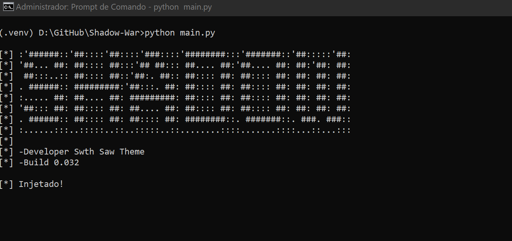

# Shadow Tool - Instruções de Uso

## ⚠️ Observações Importantes ⚠️

- Caso o executável **`Shadow.exe`** desapareça da pasta, desative seu antivírus ou o **Windows Defender** antes de continuar.

---

## 📜 Tutorial de Uso

1. **Abra o jogo** normalmente.
2. Quando o personagem aparecer na tela e for possível movimentá-lo:
   - Execute o arquivo **`Shadow.exe`**.
3. Aguarde até aparecer a mensagem **"Injetado"**.
4. **Pronto!** Agora, você pode aproveitar!

---

## 🚨 Aviso de Segurança

- Certifique-se de confiar nos arquivos que está utilizando.  
- Mantenha backups dos seus dados e sistemas para evitar qualquer problema.  

Divirta-se! 😊

---

## 📜 Atualizações

- Resolução infinita - build.0.31
- Vida infinita Adicionado! - build.0.32

## Tela In-Game

## Interface do Trainer
